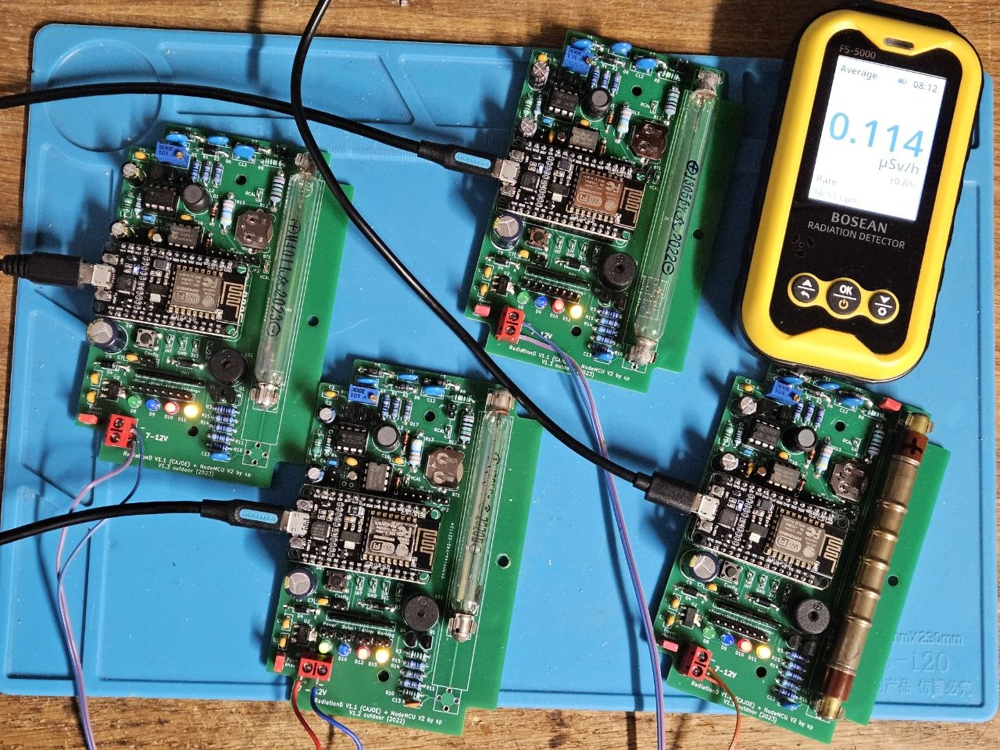

# GeigerMeasurement

An Arduino library for Geiger-Müller counters on ESP32 and ESP8266, implementing the core measurement algorithms of the **[RadPro](https://github.com/Gissio/radpro)** project by Gissio, adapted for the Arduino platform.

The library is split into two independent components that can be used together:

|File|Purpose|
|---|---|
|`GeigerTubes.h`|Tube sensitivity and radiation source correction data|
|`GeigerMeasurement.h`|Pulse buffering, rate calculation, dead-time compensation|

---

## Features

### GeigerMeasurement

- Five averaging modes: Adaptive Fast, Adaptive Precision, 10s, 30s, 60s sliding window
- Dead-time compensation (non-paralyzable / Type I model) with integer carry for long-term accuracy
- 95% confidence interval (Poisson statistics with first-order correction, RadPro formula)
- In-situ dead-time measurement from pulse buffer minimum interval
- Live calibration against a known dose-rate source
- Fault detection: tube alive, dead-time saturation, pulse counter overflow
- ESP32 / ESP8266 platform abstraction (FreeRTOS spinlock vs. noInterrupts)
- Configurable pulse buffer size via `GEIGER_PULSE_BUFFER_SIZE` preprocessor define

### GeigerTubes

- Sensitivity database for 7 common GM tubes (J305, M4011/J321, HH614, SBM-20, SI-3BG, LND7317, J305 90 mm)
- 14 radiation source presets (Cs-137, Co-60, Am-241, background, and more)
- Data from **[Rad Lab](https://github.com/Gissio/radlab)** numerical simulations via RadPro v3.1.1
- Compact uint8_t encoding (logarithmic scale) — 84 bytes vs. 336 bytes for raw floats

---

## Requirements

|Platform|Tested|
|---|---|
|ESP8266 (NodeMCU, Wemos D1)|✓|
|ESP32|✓|
|Other Arduino (AVR, SAMD)|Not tested — may require platform adaptation|

Arduino IDE 1.8+ or PlatformIO.

---

## Installation

### Arduino IDE

1. Download this repository as a ZIP file
2. In Arduino IDE: **Sketch → Include Library → Add .ZIP Library**
3. Optionally install **[RunningStats](https://github.com/soosp/RunningStats)** the same way for long-term averaging support

### PlatformIO

Add to your `platformio.ini`:

```ini
lib_deps =
    https://github.com/soosp/GeigerMeasurement
    https://github.com/soosp/RunningStats  ; optional, for long-term averaging
```

### Manual

Copy `src/GeigerMeasurement.h` and `src/GeigerTubes.h` into your sketch folder.
For long-term averaging, also copy `RollingStats.h` and `CumulativeStats.h` from the [RunningStats](https://github.com/soosp/RunningStats) library.

---

## Quick Start

```cpp
#include "GeigerMeasurement.h"
#include <RollingStats.h>

// SBM-20 tube, background radiation, 60-second sliding window
GeigerMeasurement geiger(TUBE_SBM20, SOURCE_BACKGROUND);

// 128 bins × 60s = up to 2 hours of history
RollingStats<128, 60> stats;

void IRAM_ATTR geigerISR() { geiger.onPulse(); }

void setup() {
    Serial.begin(115200);
    pinMode(D7, INPUT);
    attachInterrupt(digitalPinToInterrupt(D7), geigerISR, FALLING);
}

void loop() {
    static uint32_t last = 0;
    if (millis() - last < 1000) return;
    last = millis();

    GeigerReading r = geiger.getReading();
    if (!r.valid) return;

    Serial.printf("CPM: %.1f  µSv/h: %.4f  ±%.0f%%\n",
                  r.cpm, r.uSvH, r.confidenceHalf);

    stats.addSample(r.cpm, r.timestampMs);

    if (stats.hasWindow(3600))
        Serial.printf("1h avg: %.1f CPM\n", stats.average(3600));
}
```

---

## Wiring

The example above expects an active-low pulse signal on the GPIO pin (the tube module pulls the line low on each detected particle).

The wiring depends largely on the specific circuit design. Check the schematic diagram for details.

For example, the `INT` output of the popular educational GM circuit from China, named [RadiationD-v1.1 CAJOE](https://github.com/SensorsIot/Geiger-Counter-RadiationD-v1.1-CAJOE-) can be connected directly to a digital input of a NodeMCU, since it already includes the necessary pull-up and protective resistors.

> **NodeMCU note:** `INPUT_PULLUP` is not working with this circuit solution. Use `INPUT` as shown in the example above.

---

## API Reference

### GeigerTubes.h

Provides tube sensitivity constants and source correction data derived from RadPro v3.1.1 (Rad Lab simulations).

#### `GeigerTube` enum

Selects the GM tube type. Determines the Rad Lab baseline sensitivity used for dose-rate calculation and the field factor baseline.

```cpp
enum GeigerTube {
    TUBE_J305,      // J305 107 mm — cylindrical glass, common in budget modules
    TUBE_M4011,     // M4011 / J321 — widely used in cheap commercial counters
    TUBE_HH614,     // HH614 — cylindrical glass, also common in budget modules
    TUBE_SBM20,     // SBM-20 — Soviet-era surplus, popular in the DIY community
    TUBE_SI3BG,     // SI-3BG — low sensitivity, suited for high-radiation detection
    TUBE_LND7317,   // LND 7317 — cylindrical, halogen-quenched
    TUBE_J305_90,   // J305 90 mm — sensitivity derived from J305 107 mm (x0.721) ⚠ UNVERIFIED
    TUBE_CUSTOM,    // Custom tube — no Rad Lab data; use setSensitivity() directly
    TUBE_J321 = TUBE_M4011  // Alias — J321 shares identical Rad Lab data with M4011
};
```

|Enum|Tube|Cs-137 sensitivity (Rad Lab)|BG sensitivity (Rad Lab)|Empirical fieldFactor for BG|
|---|---|---|---|---|
|`TUBE_J305`|J305 107 mm|135.2 CPM/(µSv/h)|180.5 CPM/(µSv/h)|1.069|
|`TUBE_M4011` / `TUBE_J321`|M4011 / J321|108.3 CPM/(µSv/h)|144.6 CPM/(µSv/h)|1.269|
|`TUBE_HH614`|HH614|30.2 CPM/(µSv/h)|40.2 CPM/(µSv/h)|— (not measured)|
|`TUBE_SBM20`|SBM-20|106.1 CPM/(µSv/h)|106.1 CPM/(µSv/h)|1.611|
|`TUBE_SI3BG`|SI-3BG|3.3 CPM/(µSv/h)|3.6 CPM/(µSv/h)|— (not measured)|
|`TUBE_LND7317`|LND 7317|252.6 CPM/(µSv/h)|—|— (not measured)|
|`TUBE_J305_90`|J305 90 mm|97.5 CPM/(µSv/h) ⚠|130.1 CPM/(µSv/h) ⚠|1.069 ⚠|
|`TUBE_CUSTOM`|any|—|—|use `setSensitivity()`|

> ⚠ **TUBE_J305_90** sensitivity values are **derived**, not from Rad Lab simulation.
> The Cs-137 value is scaled from J305 107 mm by the measured length ratio (×0.721).
> The effective length of the 90 mm tube is confirmed at 72 mm (9 mm contact surfaces
> per end). The 107 mm tube has effL=89 mm, predicting a ratio of 72 mm / 89 mm = 0.809
> — still −10.9% above the measured 0.721.
> The remaining discrepancy is unresolved. Source correction factors and
> fieldFactor are assumed identical to J305 107 mm — both pending verification
> with a Cs-137 source measurement.

Cs-137 and background (BG) sensitivities are Rad Lab simulation values unless marked ⚠. Empirical field factors are measured — see [Empirical Field Factors](#empirical-field-factors) for details.

`TUBE_CUSTOM` has no Rad Lab baseline: `tubeSourceSensitivity()` returns NaN, and `setFieldFactor()` has no effect. Use `setSensitivity()` to set the sensitivity directly.

---

#### `GeigerSource` enum

Selects the radiation source preset, which applies a correction factor to the base tube sensitivity. Use `SOURCE_BACKGROUND` for ambient monitoring.

```cpp
enum GeigerSource {
    SOURCE_CS137,            // Cs-137          — 661 keV γ, standard calibration source
    SOURCE_CO60,             // Co-60           — 1.17 + 1.33 MeV γ
    SOURCE_TC99M,            // Tc-99m          — 140 keV γ, nuclear medicine
    SOURCE_I131,             // I-131           — 364 keV γ, medicine / fallout
    SOURCE_LU177,            // Lu-177          — 113 + 208 keV γ, nuclear medicine
    SOURCE_AM241,            // Am-241          — 59 keV γ, ionization smoke detectors
    SOURCE_RADIUM,           // Radium          — Ra-226 decay chain (mixed energies)
    SOURCE_URANIUM_ORE,      // Uranium ore     — U-238 decay chain
    SOURCE_URANIUM_GLASS,    // Uranium glass   — low-activity U-238
    SOURCE_DEPLETED_URANIUM, // Depleted uranium — U-238 dominant
    SOURCE_THORIUM_ORE,      // Thorium ore     — Th-232 decay chain
    SOURCE_XRAYS,            // X-rays at ~60 kV — diagnostic imaging
    SOURCE_K40,              // K-40            — 1.46 MeV γ, potassium in food/soil
    SOURCE_BACKGROUND        // Natural background — recommended default
};
```

The source correction factor is dimensionless and relative to the Cs-137 baseline (factor = 1.0 for `SOURCE_CS137`). It accounts for the tube's energy-dependent efficiency. Factors are from Rad Lab simulations.

---

#### `tubeSourceSensitivity()`

```cpp
float tubeSourceSensitivity(GeigerTube tube, GeigerSource source);
```

Returns the sensitivity in CPM/(µSv/h) for a tube/source combination. This is the value used internally by `GeigerMeasurement` and can be passed to `setSensitivity()`. Returns NaN for `TUBE_CUSTOM` or out-of-range input.

---

#### `tubeSensitivity()`

```cpp
float tubeSensitivity(GeigerTube tube);
```

Returns the base Cs-137 sensitivity. Equivalent to `tubeSourceSensitivity(tube, SOURCE_CS137)`. Returns NaN for `TUBE_CUSTOM`.

---

#### `tubeSourceFactor()`

```cpp
float tubeSourceFactor(GeigerTube tube, GeigerSource source);
```

Returns the dimensionless source correction factor only, not multiplied by base sensitivity. `1.0` = Cs-137 baseline. Useful for diagnostics.

---

#### `tubeLabel()`

```cpp
const char* tubeLabel(GeigerTube tube);
```

Returns a short human-readable name for a tube type. Suitable for Serial output, display labels, and CSV headers. Returns `"Custom"` for `TUBE_CUSTOM` or any out-of-range value.

```cpp
Serial.printf("Tube: %s\n", tubeLabel(TUBE_SBM20));   // "SBM-20"
Serial.printf("Tube: %s\n", tubeLabel(TUBE_M4011));   // "M4011/J321"
Serial.printf("Tube: %s\n", tubeLabel(TUBE_J321));    // "M4011/J321"
Serial.printf("Tube: %s\n", tubeLabel(TUBE_CUSTOM));  // "Custom"
```

---

### GeigerMeasurement.h

#### `GEIGER_PULSE_BUFFER_SIZE`

Preprocessor define to set the pulse ring buffer size. Must be a power of 2. Default: `256` (1 KB RAM).

```cpp
#define GEIGER_PULSE_BUFFER_SIZE 512
#include "GeigerMeasurement.h"
```

Or in `platformio.ini`:

```ini
build_flags = -DGEIGER_PULSE_BUFFER_SIZE=512
```

The buffer holds timestamps of recent pulses. Larger buffers allow longer adaptive windows, at the cost of RAM.

##### Default constants (`GeigerConfig` namespace)

All tunable parameters have named compile-time defaults in the `GeigerConfig` namespace. These are used internally and can be referenced in application code:

|Constant|Default|Description|
|---|---|---|
|`DEFAULT_ADAPTIVE_PULSES`|`19.0`|Target pulse count for adaptive modes|
|`DEFAULT_ADAPTIVE_MAX_WINDOW`|`5.0`|`ADAPTIVE_FAST` window cap [s]|
|`DEFAULT_ADAPTIVE_MIN_WINDOW`|`5.0`|`ADAPTIVE_PRECISION` window floor [s]|
|`DEFAULT_DEAD_TIME_MAX_FACTOR`|`10.0`|Dead-time compensation cap|
|`DEFAULT_DEAD_TIME_WARN_RATIO`|`0.8`|Saturation warning threshold (fraction of cap)|
|`DEFAULT_CALIBRATE_MAX_CONFIDENCE`|`20.0`|Default max CI for `calibrate()` [%]|

---

#### `AveragingMode` enum

Selects how the CPM rate is averaged over time.

```cpp
enum class AveragingMode {
    ADAPTIVE_FAST,       // last 19 pulses, max 5s window — fastest response, good for startup
    ADAPTIVE_PRECISION,  // last 19 pulses, min 5s window — balanced accuracy
    FIXED_10S,           // 10-second sliding window      — responsive monitoring
    FIXED_30S,           // 30-second sliding window      — general use
    FIXED_60S            // 60-second sliding window      — background monitoring
};
```

|Mode|Window|Best for|
|---|---|---|
|`ADAPTIVE_FAST`|Last 19 pulses, max 5s|Fast response, startup|
|`ADAPTIVE_PRECISION`|Last 19 pulses, min 5s|Balanced accuracy|
|`FIXED_10S`|10 seconds|Responsive monitoring|
|`FIXED_30S`|30 seconds|General use|
|`FIXED_60S`|60 seconds|Background monitoring|

A common pattern is to start in `ADAPTIVE_FAST` and switch to `FIXED_60S` after 60 seconds — see `GeigerBackground.ino` for a complete example.

---

#### `GeigerReading` struct

Returned by `getReading()`. Always check `valid` before using numerical fields.

```cpp
struct GeigerReading {
    float    cpm;                   // dead-time compensated rate [CPM]
    float    uSvH;                  // dose rate [µSv/h]
    float    confidenceHalf;        // 95% CI half-width [%]
    uint32_t pulseCount;            // raw pulses in averaging window
    uint32_t compensatedPulseCount; // dead-time compensated pulse count (integer carry)
    float    windowSec;             // actual window duration [s]
    uint32_t timestampMs;           // measurement time [ms] — use for addSample()
    bool     valid;                 // false during startup / insufficient data
    bool     saturated;             // dead-time factor > 80% of cap
    bool     tubeAlive;             // false if no pulse within timeout
    bool     counterSaturated;      // totalPulses reached UINT32_MAX
};
```

**Field notes:**

- `confidenceHalf`: 95% Poisson CI using the RadPro formula. Value of `269.0` means N≤1 (maximum uncertainty). Smaller is better.
- `compensatedPulseCount`: more accurate than `cpm * windowSec / 60` for long-term dose integration because fractional remainders are carried forward across calls.
- `timestampMs`: pass this to `RollingStats::addSample()` — do not use `millis()` directly, which has processing skew.
- `uSvH`: NaN if `TUBE_CUSTOM` and `setSensitivity()` has not been called.
- `tubeAlive`: checked via overflow-safe unsigned subtraction (`millis() - lastPulseMs < timeout`), correct across the ~49-day `millis()` rollover.

---

#### Constructor

```cpp
explicit GeigerMeasurement(
    GeigerTube    tube       = TUBE_SBM20,
    GeigerSource  source     = SOURCE_BACKGROUND,
    AveragingMode mode       = AveragingMode::FIXED_60S,
    float         deadTimeUs = 0.0f
);
```

|Parameter|Default|Description|
|---|---|---|
|`tube`|`TUBE_SBM20`|GM tube type|
|`source`|`SOURCE_BACKGROUND`|Radiation source preset|
|`mode`|`FIXED_60S`|Averaging mode|
|`deadTimeUs`|`0.0`|Dead time [µs]. 0 = disabled.|

---

#### Getters — tube, source, mode

```cpp
GeigerTube    getTube()   const;  // current tube type
GeigerSource  getSource() const;  // current source preset
AveragingMode getMode()   const;  // current averaging mode
```

---

#### `onPulse()`

```cpp
void IRAM_ATTR onPulse();
```

Records a pulse. Must be called from the GPIO interrupt handler:

```cpp
void IRAM_ATTR geigerISR() { geiger.onPulse(); }
attachInterrupt(digitalPinToInterrupt(PIN), geigerISR, FALLING);
```

On ESP32, `onPulse()` acquires the same FreeRTOS spinlock used by `getReading()`, ensuring mutual exclusion across both cores. See [Thread Safety](#thread-safety-and-interrupt-latency) for details.

---

#### `getReading()`

```cpp
GeigerReading getReading();
```

Computes and returns the current measurement. Call from `loop()`, typically once per second. Thread-safe — uses a critical section to snapshot ISR data before computing.

---

#### Pulse counters

```cpp
uint32_t totalPulses();     // pulses since last reset() — saturates at UINT32_MAX
uint32_t lifetimePulses();  // pulses since power-on — never reset, saturates at UINT32_MAX
```

Both are read under a critical section for consistency on ESP32.

---

#### `reset()`

```cpp
void reset();
```

Clears the pulse buffer and `totalPulses`. `lifetimePulses` is preserved.

---

#### Tube and source setters

```cpp
void setTube(GeigerTube tube);
void setSource(GeigerSource source);
void setTubeAndSource(GeigerTube tube, GeigerSource source);
void setSensitivity(float cpmPerUsvH);  // direct override
```

`setTube()`, `setSource()`, and `setTubeAndSource()` recompute sensitivity automatically from `GeigerTubes.h` data and reset `fieldFactor` to 1.0. No `reset()` required.

`setSensitivity()` sets the sensitivity directly — also updates `_fieldFactor` for consistency. For `TUBE_CUSTOM` only this calibration method can be used.

---

#### `setMode()`

```cpp
void setMode(AveragingMode mode);
```

Changes the averaging mode. Clears the pulse buffer. `totalPulses` and `lifetimePulses` are preserved.

---

#### Dead-time setters

```cpp
void  setDeadTime(float us);           // dead time [µs], 0 = disabled
void  setDeadTimeMaxFactor(float f);   // compensation cap (default: 10.0)
void  setDeadTimeWarnRatio(float r);   // saturated threshold (default: 0.8)
float getDeadTime()          const;    // current dead time [µs]
float getDeadTimeMaxFactor() const;    // current compensation cap
float getDeadTimeWarnRatio() const;    // current saturation threshold
```

Typical dead time for common GM tubes is 50–200 µs. The compensation cap prevents runaway correction at extreme count rates. `saturated` in `GeigerReading` is set when the compensation factor exceeds `warnRatio × maxFactor`.

As a starting point, here are some commonly used dead-time values found online:

|Tube|Value (µs)|Notes|
|---|--:|---|
|SBM-20|190|according to the datasheet|
|J305|~90|The conventional value is 50-100 µs for both 90 and 107 mm variant.|
|M4011/J321|~90|The conventional value is 50-100us.|
|SI3BG|200|Value recommended by testers on varios online forums.|
|HH614|15|According to the datasheet.|
|LND7317|40|According to the datasheet, but based on measurements elsewhere, up to 270µs is recommended.|
||||

```cpp
// Option 1: set a known value
geiger.setDeadTime(150.0f);

// Option 2: estimate from the pulse buffer (upper bound)
// Collect at least 500 pulses first for a useful estimate
float dt = geiger.measureDeadTime();
if (dt > 0) geiger.setDeadTime(dt * 1e6f);  // s → µs
```

---

#### Adaptive window setters

These clear the pulse buffer when called.

```cpp
void  setAdaptivePulses(float n);        // target pulse count (default: 19)
void  setAdaptiveMaxWindow(float s);     // ADAPTIVE_FAST cap [s] (default: 5)
void  setAdaptiveMinWindow(float s);     // ADAPTIVE_PRECISION floor [s] (default: 5)
```

#### Adaptive window getters

```cpp
float getAdaptivePulses()     const;     // current target pulse count
float getAdaptiveMaxWindow()  const;     // current ADAPTIVE_FAST cap [s]
float getAdaptiveMinWindow()  const;     // current ADAPTIVE_PRECISION floor [s]
```

---

#### Tube-alive timeout

```cpp
void     setTubeTimeoutMs(uint32_t ms);  // 0 = auto (RadPro formula, default)
uint32_t getTubeTimeoutMs() const;       // current override [ms], 0 = auto
```

When set to `0` (default), the timeout is computed from tube sensitivity:

```txt
timeout = 12 000 000 / sensitivity_CPM_per_uSvH [ms] + 1000 ms
```

Less sensitive tubes need a longer timeout because background pulses are rarer. For `TUBE_CUSTOM` before `setSensitivity()` is called, a 2-minute fallback is used.

---

#### Dead-time measurement

Two complementary methods are available. Both return an **upper bound** on τ — the true dead time may be shorter, but no interval shorter than τ was observed.

##### `getMeasuredDeadTime()`

```cpp
float getMeasuredDeadTime() const;
```

Returns the minimum inter-pulse interval observed across **all pulses since the last tube change** in µs — a continuously improving lifetime estimate. The value is updated by every pulse in `onPulse()` and is never reset by `reset()`. It is reset only by `setTube()` and `setTubeAndSource()`, since dead time is a physical property of the tube.

**Prefer this method for normal use.** It never forgets a previously observed minimum and requires no explicit trigger.

```cpp
// Apply the lifetime estimate whenever it improves:
float dt = geiger.getMeasuredDeadTime();
if (dt > 0) geiger.setDeadTime(dt);
```

##### `measureDeadTime()`

```cpp
float measureDeadTime(uint32_t sampleCount = GEIGER_PULSE_BUFFER_SIZE);
```

Scans a recent window of the pulse buffer and returns the minimum interval found. Useful when a **time-limited window** is needed:

- Diagnosing whether tube behaviour has changed recently (ageing, HV drift)
- Measuring dead time only during a high-rate event
- Limiting the scan to a specific number of recent pulses via `sampleCount`

|Parameter|Description|
|---|---|
|`sampleCount`|How many recent pulses to scan (default: full buffer)|
|**returns**|Estimated dead time [µs], or `0.0` if fewer than 2 pulses in window|

For an SBM-20 at background levels (~20 CPM), 500 pulses take ~25 minutes. A check source speeds this up considerably.

```cpp
// Snapshot the current window after enough pulses:
if (!measured && geiger.lifetimePulses() >= 500) {
    float dt = geiger.measureDeadTime();
    if (dt > 0) geiger.setDeadTime(dt);
    measured = true;
}
```

---

#### Calibration and field factor

The field factor corrects for the systematic difference between Rad Lab simulation values and real-world tube sensitivity. It is **tube- and source-specific**: automatically reset to 1.0 by `setTube()`, `setSource()`, and `setTubeAndSource()`.

```cpp
bool  calibrate(float knownUsvH, float maxConfidencePct = 20.0f);
void  setFieldFactor(float factor);   // direct: sensitivity = radlab × factor
float getFieldFactor() const;         // read back current factor
float getRadlabSensitivity() const;   // Rad Lab baseline (before correction)
void  resetFieldFactor();             // restore to 1.0 (Rad Lab default)
```

`calibrate()` computes `fieldFactor = (cpm / knownUsvH) / radlabSensitivity` and updates both `_fieldFactor` and `_sensitivity` atomically.

Returns `false` if the reading is not yet valid, `knownUsvH ≤ 0`, confidence exceeds `maxConfidencePct`, or `TUBE_CUSTOM` is in use (`setFieldFactor()` also has no effect for `TUBE_CUSTOM`).

```cpp
// Live calibration against a known reference:
while (!geiger.calibrate(0.116f, 15.0f)) { delay(1000); }
float ff = geiger.getFieldFactor();  // e.g. 1.269 — save to EEPROM/flash

// Restore on next boot without re-calibrating:
geiger.setFieldFactor(1.269f);

// Empirical values from parallel background measurements (Pannonhalma, 2026):
// TUBE_M4011:  setFieldFactor(1.269f)
// TUBE_SBM20:  setFieldFactor(1.611f)
// TUBE_J305:   setFieldFactor(1.069f)  // 107 mm variant
// See Empirical Field Factors section for measurement details.

// Custom tube (no Rad Lab baseline):
GeigerMeasurement geiger(TUBE_CUSTOM, SOURCE_BACKGROUND);
geiger.setSensitivity(130.1f);  // J305 90 mm: empirical value from 43.5h measurement
```

---

## Thread Safety and Interrupt Latency

### How shared state is protected

`onPulse()` runs in interrupt context and writes to several shared variables
(`_timestamps`, `_head`, `_count`, `_totalPulses`, `_lifetimePulses`).
`getReading()` reads all of them from the main loop. Without synchronisation,
a pulse arriving mid-read could produce an inconsistent snapshot — for example,
`_head` already incremented but the corresponding timestamp not yet written.

The library uses two complementary critical-section macro pairs:

|Macro|Used in|ESP32|ESP8266|
|---|---|---|---|
|`GEIGER_ENTER/EXIT_CRITICAL()`|task context (`getReading`, `reset`, …)|`taskENTER/EXIT_CRITICAL(&mux)`|`noInterrupts()` / `interrupts()`|
|`GEIGER_ENTER/EXIT_CRITICAL_ISR()`|ISR (`onPulse`)|`taskENTER/EXIT_CRITICAL_ISR(&mux)`|no-op|

Both pairs share the same `portMUX` spinlock on ESP32, so they mutually exclude
each other across both cores. On ESP8266, the single-core architecture means an
executing ISR already excludes the main loop — no additional locking is needed
inside `onPulse()`.

### Can a pulse be lost during the critical section?

Yes — but the probability is negligible at background levels.

`getReading()` acquires several short critical sections in sequence: the main 
buffer snapshot (256 × `uint32_t`), plus smaller snapshots in
`_windowDurationUs()`, `_applyDeadTime()`, `_applyDeadTimeCarry()` and
`_tubeAliveCheck()`. Each individual section is brief
(~0.2–1.3 µs), and their combined ISR-blocking time per `getReading()` call is
approximately **2 µs**.

At background radiation levels, pulses arrive on average every **3 seconds**
for an SBM-20. The probability of a pulse coinciding with any critical section
is:

```txt
2 µs / 3 000 000 µs ≈ 0.00007%
```

At background levels this corresponds to roughly one missed pulse every
**55 years** of continuous operation. Even at 10 000 CPM (extreme radiation),
the overlap probability is only ~3% — comparable in magnitude to the tube's
own dead-time loss, which the dead-time compensation already corrects for.

A pulse lost during the critical section is simply absent from the ring buffer,
causing a slight underestimate of CPM — identical in character to dead-time loss.
The simpler and safer design (full buffer copy under lock) is therefore preferred
over a lock-free ring buffer, which would be significantly more complex for no
meaningful practical gain.

---

## Empirical Field Factors

The Rad Lab simulation values are theoretical (Cs-137 reference geometry). In practice, the tested real GM tubes measuring background radiation show deviations — typically 1.0–1.6× — due to wall material, energy response, and geometry differences vs. the simulation model.

Use `setFieldFactor()` to apply these corrections, or `calibrate()` to determine the value for your specific tube and location.

### Measured values



**Conditions:**

- Location: Pannonhalma, Hungary — indoor, ~1 m above floor
- Duration: ~43.5 hours parallel run (lifetime average, Poisson error ~1%)
- Reference: BOSEAN FS-5000 with J321 tube, RadPro 3.1.1 (factory calibration)
  displaying ~16.6 CPM → 0.115 µSv/h, consistent with regional OMSZ/HM
  monitoring network data (~0.087–0.115 µSv/h in the Győr–Pápa region)
- Hardware: ESP8266 NodeMCU, ~380–400V HV, `SOURCE_BACKGROUND`

|Tube|CPM (measured)|fieldFactor|Notes|
|---|--:|--:|---|
|M4011|21.11|**1.269**||
|SBM-20|19.66|**1.611**|Largest deviation — steel wall energy filtering(?)|
|J305 107 mm|22.19|**1.069**|Close to Rad Lab prediction|
|J305 90 mm|14.96|⚠ 1.069|Use `TUBE_J305_90` (derived) or `setSensitivity(130.1f)` with `TUBE_CUSTOM`|
|||||

**Key ratios vs. Rad Lab predictions:**

|Ratio|Measured|Rad Lab|Deviation|
|---|--:|--:|--:|
|M4011 / SBM-20|1.074|1.363|−21.2%|
|J305 107 mm / SBM-20|1.129|1.701|−33.6%|
|J305 107 mm / M4011|1.051|1.248|−15.8%|
|||||

> These are single-location measurements on individual tube samples.
> Your values may differ due to tube-to-tube manufacturing tolerances,
> HV supply accuracy, and local radiation field composition.

---

## Example Sketches

|Sketch|Description|
|---|---|
|`GeigerMeasurement.ino`|Minimal single-file example|
|`GeigerMonitor.ino`|Full-featured monitor with RunningStats|
|`GeigerBackground.ino`|Background monitoring with adaptive→fixed mode transition|
|`GeigerCompare.ino`|Parallel tube sensitivity comparison — CSV output, lifetime average, accumulated dose|
|`GeigerPulseIndicator.ino`|Demonstrates per-pulse LED flash and passive buzzer click indicators|

---

## Optional: RunningStats

For long-term averaging (30-minute, 1-hour, 24-hour windows), install the companion library: **[RunningStats](https://github.com/soosp/RunningStats)**

```cpp
#include "GeigerMeasurement.h"
#include <RollingStats.h>  // from soosp/RunningStats

RollingStats<128, 60> stats;  // 128 bins × 60s = 2 hours

// In loop():
stats.addSample(r.cpm, r.timestampMs);

if (stats.hasWindow(3600))
    Serial.printf("1h avg: %.1f CPM\n", stats.average(3600));
```

See `GeigerMonitor.ino` and `GeigerBackground.ino` in `examples` for more complete examples.

---

## Development note

This library was designed and developed by Péter Soós in collaboration with Claude (Anthropic AI assistant). The iterative design process — including algorithm selection, architecture decisions, code review, and documentation — was conducted through an extended conversation with Claude.

---

## Acknowledgements

Core algorithms adapted from **[RadPro v3.1.1](https://github.com/Gissio/radpro)** (MIT License). Sensitivity data originally computed by **[Rad Lab](https://github.com/Gissio/radlab)**, a separate simulation tool by the same author. Special thanks to Gissio for both projects.

---

## License

MIT License — see [LICENSE](LICENSE) for details.
